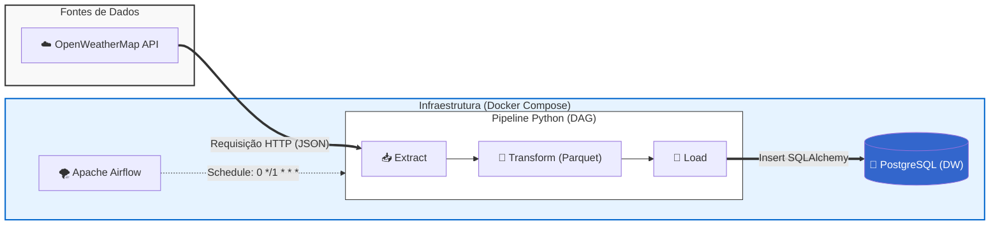

# 🌤️ Pipeline ETL - Dados Meteorológicos (São Paulo/BR)

> **Status do Projeto:** Concluído ✅

Um pipeline de dados de ponta a ponta (End-to-End) construído para extrair, transformar e carregar dados climáticos em tempo real da cidade de São Paulo, utilizando as melhores práticas de Engenharia de Dados, orquestração em containers e modelagem relacional.

---

## 🎯 Objetivo
O objetivo deste projeto é construir uma infraestrutura de dados resiliente e automatizada capaz de consumir dados da API do OpenWeatherMap, normalizar estruturas JSON complexas, realizar conversões de fuso horário e carregar os dados em um Data Warehouse (PostgreSQL) para viabilizar análises climáticas futuras.

## 🏗️ Arquitetura de Dados

O fluxo de dados foi desenhado para ser escalável, isolado e de fácil manutenção, utilizando Apache Airflow rodando em Docker para a orquestração.

🛠️ Stack Tecnológica
Linguagem: Python 3.10+

Orquestração: Apache Airflow

Armazenamento / DW: PostgreSQL 16

Processamento: Pandas, requests, sqlalchemy

Containerização: Docker & Docker Compose

Gestão de Dependências: uv (Ultra-fast Python package installer)

📁 Estrutura do Projeto
A organização do código segue o padrão de módulos para facilitar testes e manutenção:

Plaintext
├── config/                 # Arquivos de configuração e variáveis de ambiente (.env)
├── dags/                   # DAGs do Apache Airflow (orquestração)
│   └── weather_dag.py
├── data/                   # Armazenamento temporário de dados (JSON RAW e Parquet)
├── notebook/               # Jupyter Notebooks para Análise Exploratória (EDA)
├── src/                    # Scripts core do pipeline ETL
│   ├── extract_data.py
│   ├── transform_data.py
│   └── load_data.py
├── docker-compose.yaml     # Infraestrutura em containers (Airflow, Postgres, Redis)
├── pyproject.toml / uv.lock# Controle de dependências do Python
└── main.py                 # Script para execução local e debug (sem Airflow)

🔄 Fluxo de Processamento (ETL)
Extract (src/extract_data.py): * Conecta à API do OpenWeatherMap via requisição HTTP.

Valida a resposta e salva o dado bruto como um artefato JSON em disco (conceito de Data Lake / Landing Zone) para garantir rastreabilidade.

Transform (src/transform_data.py):

Lê o arquivo JSON e utiliza o Pandas (json_normalize) para "achatar" os dados aninhados.

Limpa colunas desnecessárias e renomeia variáveis para o padrão de negócio.

Converte timestamps (UTC) para o fuso horário local (America/Sao_Paulo).

Best Practice: Salva os dados transformados em formato .parquet para transitar entre as tasks do Airflow com alta performance e tipagem segura.

Load (src/load_data.py):

Lê o arquivo .parquet.

Abre conexão com o PostgreSQL via SQLAlchemy.

Realiza o append dos dados na tabela sp_weather e emite logs de contagem de registros para auditoria.

🚀 Como Executar o Projeto
1. Pré-requisitos
Git instalado.

Docker e Docker Compose instalados e em execução.

Criar sua chave de API gratuita no OpenWeatherMap.

2. Configurando o Ambiente
Clone o repositório e crie o arquivo de variáveis de ambiente:

Bash
git clone [https://github.com/SidneyAnjos/Pipeline_etl_weather_data.git](https://github.com/SidneyAnjos/Pipeline_etl_weather_data.git)
cd Pipeline_etl_weather_data
Crie o arquivo config/.env e adicione suas credenciais:

Snippet de código
# config/.env
API_KEY=sua_chave_aqui_do_openweathermap
user=airflow
password=airflow
database=airflow
Configure as permissões de usuário para o Airflow no Docker (Linux/WSL):

Bash
echo -e "AIRFLOW_UID=$(id -u)" > .env
3. Subindo a Infraestrutura
Bash
docker-compose up -d
Aguarde alguns minutos para que os containers (Webserver, Scheduler, Worker, Postgres, Redis) fiquem healthy.

4. Orquestrando o Pipeline
Acesse a interface do Airflow em: http://localhost:8080 (Usuário: airflow / Senha: airflow).

Ative a DAG youtube_weather_pipeline no toggle lateral.

A DAG executará o ETL automaticamente a cada hora (0 */1 * * *).

Desenvolvido por Sidney Anjos.
